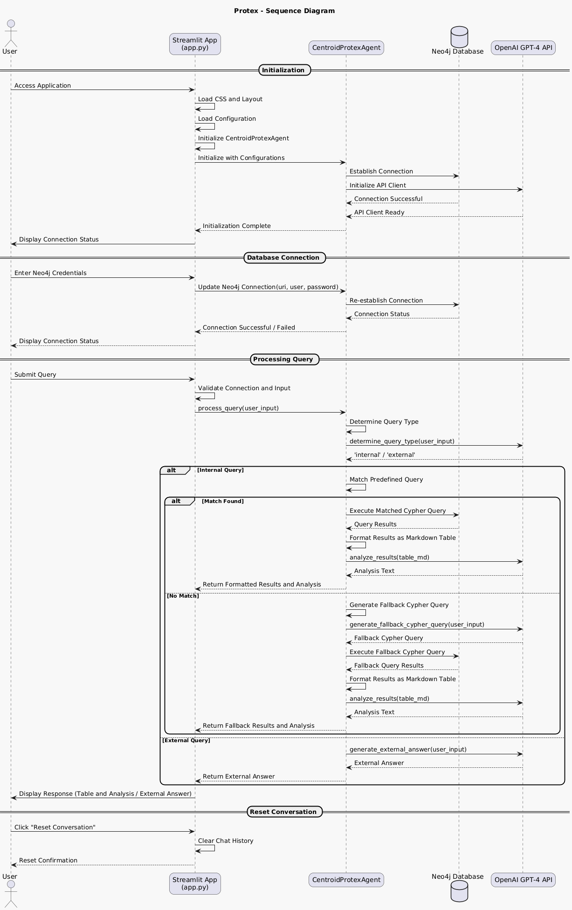

# speak2neo

## Steps

1. **Clone the repository:**
    ```bash
    git clone https://github.com/clumsyspeedboat/speak2neo.git
    ```

2. **Create and activate a virtual environment:**
    ```bash
    python -m venv env
    source env/bin/activate  # On Windows use `env\Scripts\activate`
    ```

3. **Install the required packages:**
    ```bash
    pip install -r requirements.txt
    ```
	
4. **Run streamlit app:**
    ```bash
    streamlit run app.py
    ```

5. **Paste the following on a Web browser:**
    `
    http://localhost:8501 # Check terminal for correct port
    `
---

### Class Diagram


**Figure 1:** *Class Diagram showcasing the relationship between bioLink components and the CentroidProtexAgent.*

**Description:**

- **CentroidProtexAgent:**
  - **Attributes:**
    - `neo4j_helper`: Manages interactions with the Neo4j database.
    - `openai_chat`: Interfaces with the OpenAI GPT-4 API for natural language processing.
    - `predefined_queries`: Stores a collection of predefined Cypher queries for internal data retrieval.
    - `system_prompt` & `user_prompt`: Templates used to generate prompts for the OpenAI API.
  - **Methods:**
    - `process_query()`: Core function to handle and process user queries.
    - `update_neo4j_connection()`: Updates Neo4j connection parameters dynamically.
    - Additional methods for query determination, generation, execution, and analysis.

- **Neo4jHelper:**
  - **Attributes:**
    - `uri`, `user`, `password`: Credentials for connecting to the Neo4j database.
  - **Methods:**
    - `run_query()`: Executes Cypher queries against the Neo4j database.
    - `is_connected()`: Checks the status of the database connection.

- **OpenAIChat:**
  - **Attributes:**
    - `api_key`: API key for accessing OpenAI services.
    - `model`: Specifies the OpenAI model to use (e.g., GPT-4).
  - **Methods:**
    - `generate_query()`: Sends prompts to OpenAI and retrieves responses.

- **Utility Classes:**
  - `ContextLoader`: Facilitates the loading of context data from JSON files.
  - `PromptLoader`: Manages the loading of agent prompts from configuration files.

---


---

### Sequence Diagram



**Figure 2:** *Sequence Diagram depicting the interaction flow between the user, Streamlit App, CentroidProtexAgent, Neo4j Database, and OpenAI GPT-4 API.*

**Description:**

1. **Initialization:**
   - The user accesses the Streamlit application and inputs Neo4j credentials.
   - The `CentroidProtexAgent` is initialized with these configurations, establishing connections with both Neo4j and the OpenAI GPT-4 API.

2. **Query Processing:**
   - The user submits a natural language query through the Streamlit interface.
   - The `CentroidProtexAgent` determines whether the query is internal (related to the knowledge base) or external.
     - **Internal Query:**
       - Attempts to match the query with predefined Cypher queries.
       - Executes the matched or fallback Cypher query against Neo4j.
       - Formats the results into a Markdown table.
       - Analyzes the results using the OpenAI API.
     - **External Query:**
       - Generates an external answer directly using the OpenAI API without interacting with Neo4j.

3. **Response Delivery:**
   - The processed response, including data tables and analyses, is sent back to the Streamlit application.
   - The user views the results and can continue the interaction or reset the conversation as needed.
---
